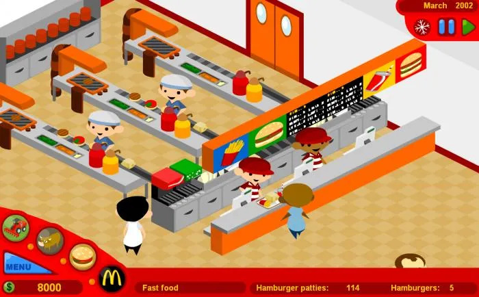
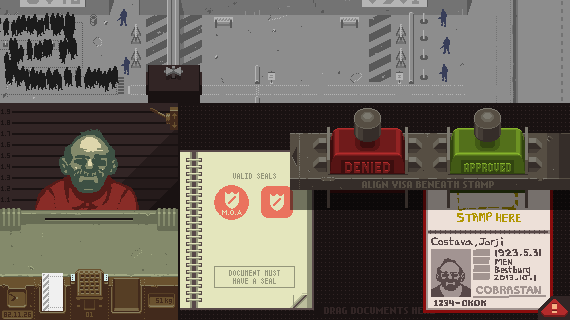
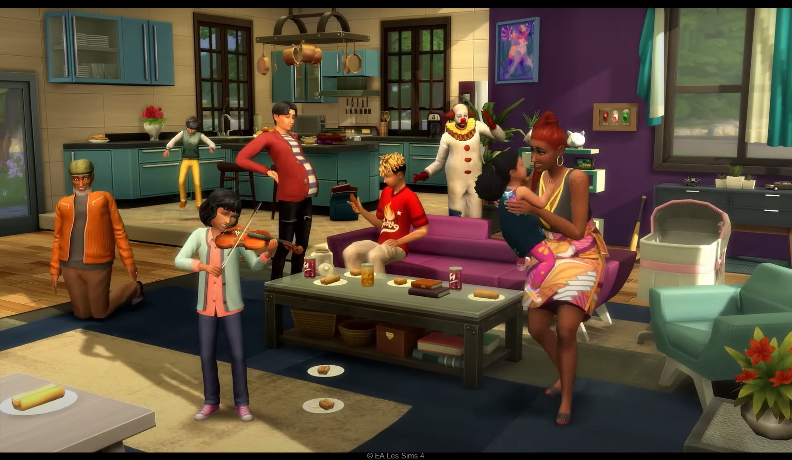
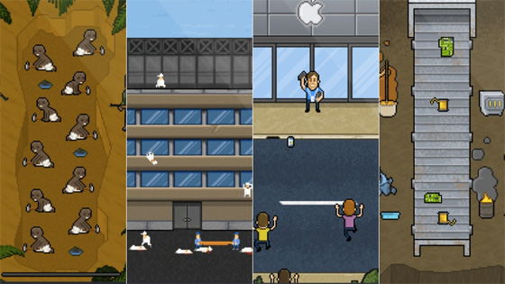

# Simulations

In this two-hour class, we will explore simulations as both a creative medium and a form of rhetorical expression, focusing on the concept of **Procedural Rhetoric**—the use of rules, systems, and processes to convey ideas and arguments. We’ll examine how game engines and simulations have been used as tools for artistic expression and critical inquiry, drawing on examples like Ian Cheng’s *Emissaries*. I will provide a hands-on demo of Nicky Case’s *Emoji Simulator* to introduce the fundamentals of creating and manipulating simple simulations.

Following the demo, we will engage in a group discussion to brainstorm potential topics and themes that can be explored through this medium. Students will then work on developing their own basic simulations, with a focus on how systems and rules can communicate concepts. At the end of the session, we will share and discuss the simulations created by the class, reflecting on both the process and the ideas conveyed.

## About me

## Procedural Rhetoric

**Procedural Rhetoric** is a concept in game studies, coined by Ian Bogost, that refers to the way rules, processes, and mechanics in games and other procedural systems convey arguments or ideas. Unlike traditional rhetoric, which uses language, procedural rhetoric uses the interactivity and logic of systems to persuade or express meaning, shaping how players understand concepts through their actions and the rules governing those actions.

Player Action → System Rules → Outcome/Feedback → Message/Argument

+ **Rules as Arguments**:
   - Games are built on rules and systems that define how players interact with the world.
   - These rules themselves make arguments, showing cause-and-effect relationships or reinforcing behaviors.
   - *Example*: A game about environmental conservation might limit resources to highlight sustainability.

+ **Player Interaction**:
   - Procedural rhetoric relies on the player’s actions and decisions within the system to experience the argument firsthand.
   - Instead of passively consuming a message, players actively engage with it through gameplay.
   - *Example*: In **"Papers, Please"** by Lucas Pope, players act as border agents, facing moral dilemmas that critique bureaucracy and authoritarianism.

+ **Emergent Meaning**:
   - Procedural rhetoric often emerges from player choice, where the systems reveal broader themes.
   - This method contrasts with fixed narratives, offering a dynamic way of understanding.
   - *Example*: **"The Sims"** can unintentionally reveal cultural norms around capitalism, family structures, or consumerism.

Procedural rhetoric is the practice of using the rules, systems, and processes within games or simulations to convey ideas, arguments, or critiques. Coined by Ian Bogost, it focuses on how interaction and mechanics can express meaning beyond traditional forms like text or visuals.

+ **Critical and Political Potential**:
   - Procedural rhetoric is often used to critique social systems or explore complex topics.
   - It’s especially powerful in highlighting systemic injustices, inequalities, or environmental issues.

### Examples

+ [Molleindustria - McDonald's Game](https://www.molleindustria.org/mcdonalds/)
+ [Francis Tseng - The Founder](http://thefounder.biz/play/)
+ Mary Flanagan – [Values at Play](http://www.valuesatplay.org/) and [Critical Play](https://www.criticalplay.org/)
+ [Anna Anthropy – Dys4ia](https://w.itch.io/dys4ia)

## Simulation as Art

With the term **Simulations-as-Art** I am referring to to the use of dynamic, interactive systems to explore complex, evolving ideas, often through the lens of computational processes. Artists create simulations that unfold in real-time, engaging viewers or participants in emergent narratives, systems of thought, or aesthetic experiences.

### Examples

+ [Ian Cheng - Emissaries](https://youtu.be/TO6Luilc4Bo?t=150)
+ [Jacolby Satterwhite](https://www.youtube.com/watch?v=9WwRz4lWoFw)
+ [Brody Condon - KarmaPhysics < Elvis](https://vimeo.com/24001068)
+ [Danielle Brathwaite-Shirley](https://buffaloakg.org/person/danielle-brathwaite-shirley)

## Emoji Simulator

[Link to Emoji Simulator](https://ncase.me/sim/)

- **Purpose**: Emoji Simulator is typically used to represent systems, relationships, or processes through the use of emojis. These emojis act as lightweight, intuitive symbols that convey meaning quickly, often in a humorous or visually appealing way.
- **Flexibility**: It can be applied to everything from conveying abstract concepts (like ecosystems or social systems) to creating interactive art or storytelling.

